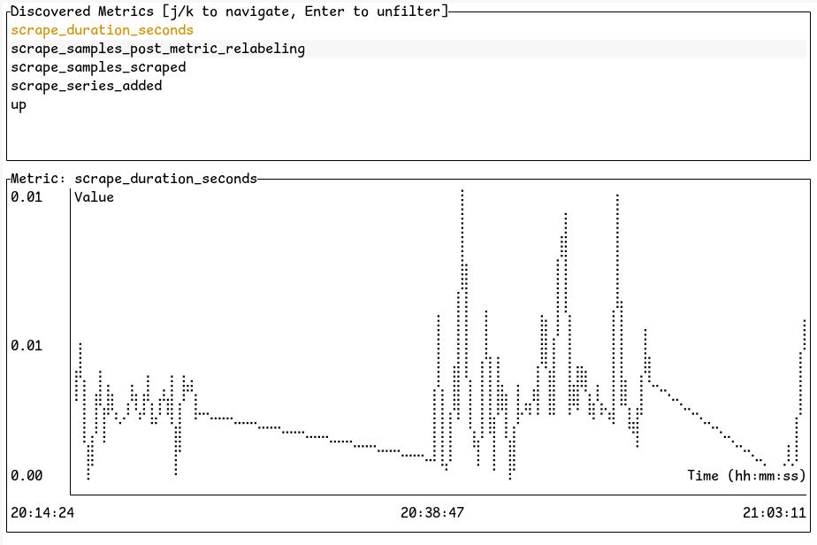

# Otel CLI Dashboard

Otel CLI Dashboard is a Rust-based application that collects and displays
telemetry data using OpenTelemetry. It provides a terminal user interface (TUI)
to discover and visualize metrics in real-time.



## Features

- Collects logs and metrics using OpenTelemetry
- Displays metrics in a terminal user interface (TUI)
- Supports filtering and navigating through discovered metrics
- Visualizes metric data points in a graph

## Installation

1. Clone the repository:
    ```sh
    git clone https://github.com/yourusername/telemetry-dashboard.git
    cd telemetry-dashboard
    ```

2. Install dependencies:
    ```sh
    cargo build
    ```

## Usage

1. Run the Telemetry Dashboard:

    ```sh
    cargo run -- --address 127.0.0.1:4317 --debug
    ```

2. Configure the Otel Collector to send telemetry data to the dashboard:
    ```yaml
    exporters:
      otlp:
        endpoint: localhost:4317
        compression: none
        tls:
          insecure: true
    ```

3. Start the telemetry generator:
    ```sh
    $GOPATH/bin/telemetrygen logs --duration 5s --otlp-insecure
    $GOPATH/bin/telemetrygen metrics --otlp-insecure --metrics 1
    ```

## Command Line Arguments

- `--address`: The address to bind the OTLP receiver (default: `127.0.0.1:4317`)
- `--debug`: Enable debug mode for more verbose logging

## Key Bindings

- `j`: Navigate down the list of discovered metrics
- `k`: Navigate up the list of discovered metrics
- `Enter`: Toggle the selected metric to show/hide the graph
- `q`: Quit the application

## License

This project is licensed under the MIT License. See the [LICENSE](LICENSE) file for details.

## Acknowledgements

- [OpenTelemetry](https://opentelemetry.io/)
- [Ratatui](https://github.com/fdehau/ratatui)
